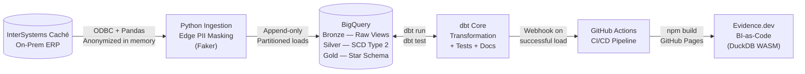

# Legacy-to-Cloud Modern Data Stack Platform

[](https://github.com/ederpalavissiniteixeirajunior-cloud/portfolio-ae-cache-to-bigquery/actions/workflows/deploy.yml)
[](https://github.com/dbt-labs/dbt-core)
[](https://cloud.google.com/bigquery)
[](https://evidence.dev/)
[](https://github.com/features/actions)
[](#finops--zero-cost-architecture)

An end-to-end Analytics Engineering platform that migrates transactional data from a 20-year-old on-premises ERP (**InterSystems Caché**) into a fully automated, cloud-native Modern Data Stack on **Google BigQuery** — demonstrating senior-level proficiency in data governance, dimensional modeling, and Analytics as Code, at absolute zero infrastructure cost.

> **Context:** Data extracted from a real fashion brand's production ERP. All PII is anonymized at the ingestion boundary using the Faker library before any data leaves the on-premises environment, ensuring proactive LGPD/GDPR compliance.

---

## Live Links

| | Link |
|---|---|
| **Dashboard** | [Evidence.dev Sales Analytics →](https://ederpalavissiniteixeirajunior-cloud.github.io/portfolio-ae-cache-to-bigquery) |
| **Data Lineage** | [dbt Docs — DAG & Column Catalog →](https://ederpalavissiniteixeirajunior-cloud.github.io/portfolio-ae-cache-to-bigquery/dbt-docs) |

Both are automatically rebuilt and deployed via GitHub Actions on every push to `main` and daily at 07:00 BRT.

---

## Architecture



---

## Stack

| Layer | Technology | Role |
|---|---|---|
| **Source** | InterSystems Caché | 20-year-old on-prem transactional ERP |
| **Ingestion** | Python 3.9 + Pandas + Faker | Edge ETL with in-memory PII anonymization |
| **Data Warehouse** | Google BigQuery (Sandbox) | Cloud storage, compute, and SQL engine |
| **Transformation** | dbt Core 1.10+ | Medallion modeling, testing, documentation |
| **Orchestration** | GitHub Actions + cron (VPS) | Zero-cost pipeline automation |
| **BI / Visualization** | Evidence.dev + DuckDB WASM | BI-as-Code, client-side compute, GitHub Pages |

---

## Key Technical Highlights

### 1. Edge Data Governance (LGPD/GDPR Compliant)
PII fields (name, email, phone, document numbers, address) are anonymized **in memory on the on-prem server** using Faker before any data is transmitted to the cloud. No raw PII ever reaches BigQuery. A custom dbt macro (`mask_pii_info`) provides an additional dev/test layer of masking for non-production environments.

### 2. SCD Type 2 with Point-in-Time Joins
Three core dimensions (`customers`, `products`, `sales_representatives`) are tracked as Slowly Changing Dimensions Type 2 using dbt snapshots. Fact tables resolve the **exact historical state** of each dimension at the time of every transaction using `BETWEEN valid_from AND COALESCE(valid_to, '9999-12-31')` join logic — enabling True Point-in-Time Profitability analysis.

### 3. Medallion Architecture
| Layer | Schema | Materialization | Purpose |
|---|---|---|---|
| Bronze | `raw` | Views | Type-cast and rename from source |
| Silver | `silver` | Tables | Deduplicate, conform, apply SCD snapshots |
| Gold | `gold` | Partitioned Tables | Star schema with surrogate keys |
| Analytics | `analytics` | Views | Aggregated views for dashboard consumption |

### 4. Dimensional Modeling Best Practices
- **Surrogate keys** generated via `dbt_utils.generate_surrogate_key` (deterministic hashing)
- **Version-keyed foreign keys** (`sk_*_version`) in fact tables point to the exact SCD Type 2 record
- **Fact tables partitioned by `dt_issued`** and clustered by dimension keys, minimizing BigQuery slot consumption
- **Degenerate dimensions** (natural business keys) preserved in facts for operational audit trail

### 5. FinOps — Zero Infrastructure Cost
- BigQuery Sandbox: 10 GB storage + 1 TB/month query compute (free tier)
- Evidence.dev renders dashboards client-side using **DuckDB WASM** in the user's browser, eliminating query slot consumption at display time
- GitHub Pages: zero-cost static hosting with global CDN
- GitHub Actions: free tier CI/CD for public repositories

### 6. Data Quality Contracts
20+ automated dbt tests enforcing:
- `unique` + `not_null` on all primary keys
- `relationships` tests validating referential integrity across all fact → dimension joins
- `not_null` on critical measures and degenerate dimensions

---

## Project Structure

```
portfolio-ae/
├── ingestion/
│   ├── cache_ingestion.py       # Edge ETL: source extraction + in-memory PII masking
│   └── requirements.txt
├── dbt_project/
│   ├── models/
│   │   ├── staging/             # Bronze: type casting, renaming, PII macro application
│   │   ├── intermediate/        # Silver: deduplication, SCD prep, dimension conformation
│   │   ├── marts/
│   │   │   ├── dimensions/      # dim_customers, dim_products, dim_sales_representative,
│   │   │   │                    # dim_collection, dim_calendar (all with schema.yml tests)
│   │   │   └── facts/           # fct_orders, fct_order_items (partitioned + clustered)
│   │   └── analytics/           # Aggregated views consumed by Evidence.dev
│   ├── snapshots/               # dbt SCD Type 2 snapshots (customers, products, reps)
│   ├── macros/                  # mask_pii_info, convert_money, generate_audit_columns
│   └── seeds/                   # seed_collection.csv, seed_sales_target.csv
├── dashboard/
│   └── pages/                   # Evidence.dev markdown pages (BI-as-Code)
└── .github/workflows/
    └── deploy.yml               # CI/CD: build Evidence dashboard → GitHub Pages
```

---

## Data Model

The Gold layer implements a classic **Star Schema** with SCD Type 2 support:

```
                    ┌─────────────────┐
                    │  dim_calendar   │
                    │  (sk_time_vers) │
                    └────────┬────────┘
                             │
┌──────────────┐    ┌────────┴────────┐    ┌──────────────────────┐
│ dim_customers│    │   fct_orders    │    │dim_sales_representative│
│ (SCD Type 2) ├────┤  fct_order_items├────┤      (SCD Type 2)    │
└──────────────┘    └────────┬────────┘    └──────────────────────┘
                             │
              ┌──────────────┴──────────────┐
              │                             │
    ┌─────────┴────────┐       ┌────────────┴───────┐
    │  dim_products    │       │   dim_collection   │
    │  (SCD Type 2)    │       │  (seed-backed)     │
    └──────────────────┘       └────────────────────┘
```

---

## Getting Started

### Prerequisites

| Requirement | Details |
|---|---|
| Python 3.9+ | For the ingestion script |
| dbt Core 1.10+ | With `dbt-bigquery` adapter |
| Google Cloud account | BigQuery project with billing enabled |
| Node.js 18+ | For Evidence.dev dashboard |

### Environment Variables

Copy and configure the following before running:

```bash
# ingestion/.env  (VPS only — see ingestion/.env.example)
GCP_PROJECT_ID=your-gcp-project-id
GCP_DATASET_RAW=raw
GOOGLE_APPLICATION_CREDENTIALS=/absolute/path/to/your/gcp-key.json
CACHE_DSN=YOUR_ODBC_DSN_NAME
```

The `DBT_BRAND_SCOPE` variable used by dbt is configured as a **GitHub Secret** (`Settings → Secrets → Actions`) and injected into the CI/CD pipeline at runtime — it does not belong in the VPS `.env`.

### Running the Pipeline

```bash
# 1. Install Python dependencies
pip install -r ingestion/requirements.txt

# 2. Run ingestion (extracts + anonymizes + loads to BigQuery)
python ingestion/cache_ingestion.py

# 3. Run dbt transformations
cd dbt_project
dbt deps
dbt run
dbt test

# 4. Launch Evidence.dev dashboard locally
cd ../dashboard
npm install
npm run sources   # pull data from BigQuery
npm run dev
```

---

## About

Built by **Eder Palavissini Jr.** — BI Manager & Senior Analytics Engineer with 5+ years delivering data platforms across retail, fashion, and e-commerce.

- **LinkedIn:** [linkedin.com/in/ederpalavissiniteixeirajunior](https://www.linkedin.com/in/ederpalavissiniteixeirajunior)
- **GitHub:** [github.com/ederpalavissiniteixeirajunior-cloud](https://github.com/ederpalavissiniteixeirajunior-cloud)
- **Email:** ederpalavissiniteixeirajunior@gmail.com
